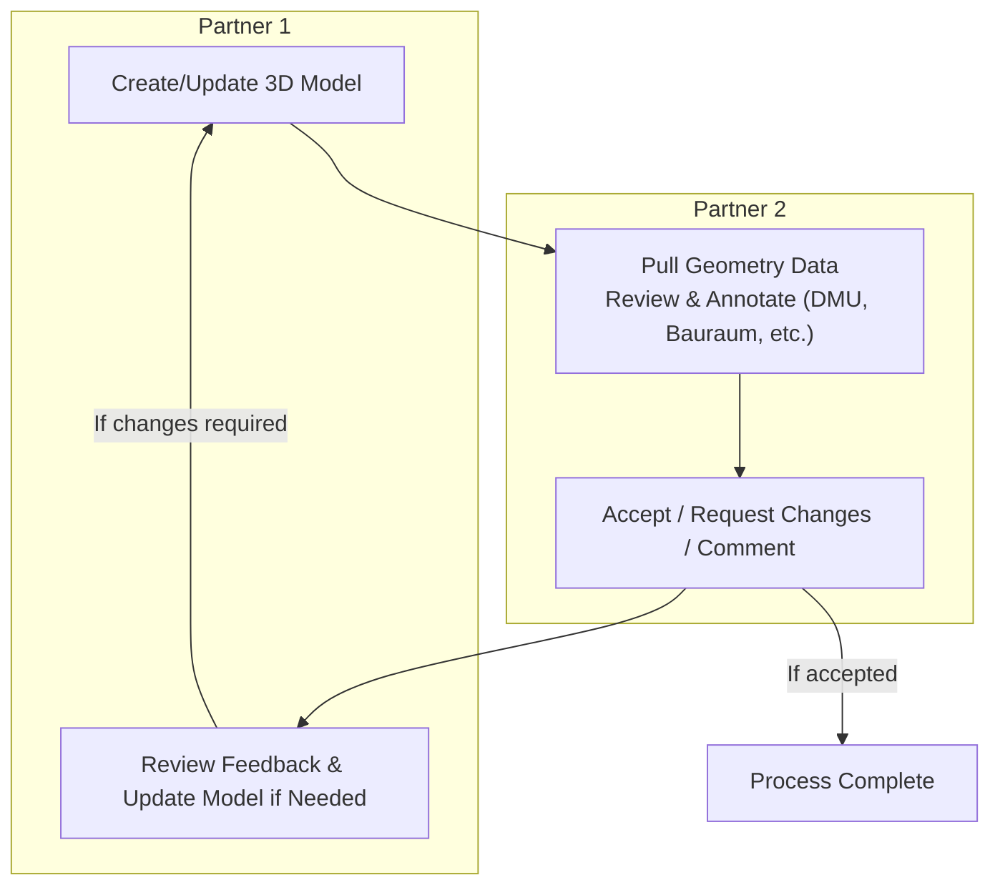
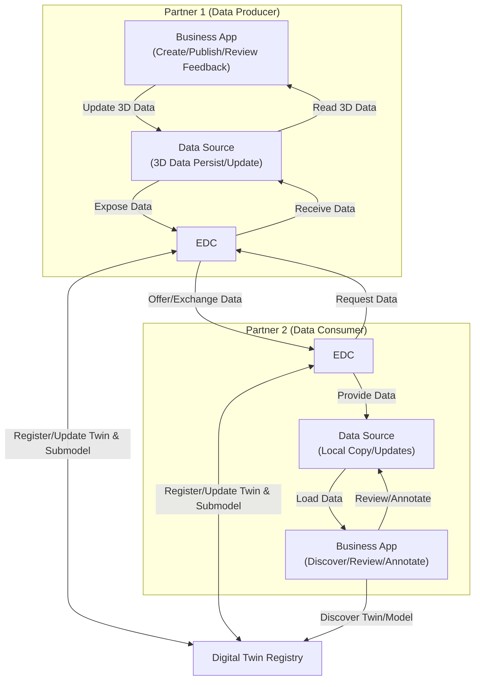

<!-- TODOs: 

Reference Implemenation
- Where is the reference implementation sitting? What repo? 

Section Use Case

- Use Case selection: WG needs to align on Use Cases we are gonna describe that are relevant
  - Currently Engineering Collaboration as the Use Case favoured. 
  
- User Journey Diagram and description. We need to describe how a user would interact with geometry. Meaning the use case of: Geometry is created -> Shared with Partner 2 -> Partner 2 Reviews -> Gives back to Partner 1 ... see WG Miro HANNES
- Customer Joureny: https://eclipse-tractusx.github.io/docs-kits/kits/requirements-kit/adoption-view#customer-journey HANNES 

Section: Geometry understanding
- Description of structure of 3D Data vs. BOM Structure. See SBOM Standard https://github.com/catenax-eV/product-standardization-prod/blob/R25.09-CX-XXXX-CarSBOM/standards/CX-XXXX-CarSBOM/CX-XXXX-CarSBOM.md#53-tier-n-sbom-propagation-option-1 SARAH 

Describe Relevant Related Standards: 
- Geometry Standard
- Binary Exchange (Standard or aspect model)
- Master Data 
SARAH 

Example Files and Understanding: 
- Describe participant overview (how many and role) 
- Descibe Overall "Product" the full bike
- Descibe SupplyChain of participants (Who supplies what to whom)
- Provide description of 3D Data set Motorbike with definition of participants and data ownership
MICHAEL 
 
 -->

## Vision & Mission

### Vision

The vision of the **3D KIT** is to enable secure and sovereign exchange of engineering 3D information across the entire value chain and all n-tier levels in Catena-X. It focuses on making 3D assets—such as CAD models, simulation data, and their associated metadata from PLM and related systems—discoverable, accessible, and reusable for data-driven use cases without compromising data sovereignty.

The Kit provides a uniform, standards-based foundation for interoperability between Business Partners when sharing 3D information. It covers master data (Stammdaten), geometric and simulation data, as well as derived 2D artifacts like PDF technical drawings, ensuring that participants can build consistent, trusted 3D data chains throughout the lifecycle of products and components.

### Mission

The 3D KIT bundles the necessary Catena-X standards, profiles, APIs, semantic models, and reference implementations to publish, discover, request, and consume 3D information in the dataspace. It provides clear guidance and tooling to map data from enterprise PLM/CAE systems into Catena-X-compliant representations and exchange large files efficiently and securely.

By adopting and aligning existing Catena-X standards (e.g., Digital Twins, Data Chain, and BinaryDataExchange) and complementing them where needed for 3D, the 3D KIT enables rapid implementation of multiple use cases. Seamless interoperability with the Connector KIT and adjacent Kits is a priority to ensure end-to-end adoption across the ecosystem, including support for 3D master data, geometry and 2D PDF drawings.

## Business Value & Benefits

### Business Value

The "Geometry-KIT" provides guidelines and standards, such as semantic models and data exchange processes, which help companies create a reliable and sovereign data exchange system with their partners.

This reduces cost and effort needed to integrate data-driven engineering processes into their operations and IT systems.

Since this KIT is built on the Industry Core KIT and will be closely connected to upcoming other KITSs within the Engineering Domain, investment and implementation costs to integrate requirement services are reduced.

In the product design and engineering phase, companies must collaborate closely with partners to co-engineer, plan, and industrialize products. 3D data is the core medium of that collaboration, yet exchange today is cumbersome, redundant, and error-prone. The 3D KIT provides a consistent way to share and consume 3D information (CAD and derived 2D drawings) via Catena-X—reducing cycle times, avoiding duplicate data silos, and improving quality through standardized semantics, interfaces, and secure large-file transfer. At a high level, the initial focus areas are supplier updates to master and 3D data, and BTV-side processing and adoption of 3D data.

By leveraging Catena-X standards, participants can automate early collaboration processes, ensure up-to-date master and geometry data across partners, and integrate directly with enterprise PLM/CAE systems. This lowers onboarding effort, enables repeatable integrations, and accelerates time-to-value for 3D-centric use cases.

As context, the two highlighted scenarios fit a broader cross-company 3D engineering flow: one party authors and publishes updated master/geometry data, while another discovers, validates, and operationalizes it within PLM/CAE and downstream processes. This framing keeps the Kit applicable to many role constellations beyond a single supplier–BTV setup.

### Todays Challenge

As product development becomes more and more cross-company, the ...

### Benefits for OEM, SME and Solution Provider

#### OEM and large automotive suppliers

The Geometry Kit presents a transformative solution for OEMs and large automotive suppliers, fundamentally optimizing their ...

#### SME

The Geometry Kit offers significant advantages for Small and Medium-sized Enterprises (SMEs), streamlining what can often be a complex and resource-intensive aspect of their operations. One of the most impactful benefits is the simplification of the ...

#### Solution Provider

Catena-X offers solution providers a variety of strategic advantages to leverage their innovation capabilities and strengthen their market position beyond the automotive industry. Here are some examples of how solution providers can benefit from Catena-X technology:

...

## Use Case

All of the following use cases rely on shared 3D data and cross-company collaboration. The 3D KIT provides the common APIs, semantic models, and secure large-file exchange to enable them consistently across partners.

### DMU Analysis (Digital Mock-Up)

Analyze CAD data with semi-advanced techniques—such as measurements, clash detection, sectioning, and visual heatmaps — to verify that requirements are met across design, manufacturing, packaging, interfaces, accessibility, and serviceability. Supports early-stage maturity assessments and issue resolution for product designs.

#### Key Capabilities

- Clash detection and gap measurement
- Assembly positioning and verification
- Flexible selection of coordinate systems (part or vehicle origin)
- Visualization of individual components and composite assemblies

#### Relevant Information & Inputs

- 3D CAD Model reference
- Bounding boxes and spheres for spatial analysis
- Vehicle origin (global positioning) and component origin (local positioning)
- Translation, rotation, and constraints
- Embedded kinematic data

### Buildroom (Bauraum) Analysis

Validate space allocations against as-designed geometry to ensure that clearances, assembly and disassembly paths, and manufacturability constraints are respected. This use case helps confirm compliance with reserved installation space and upstream/downstream requirements throughout the engineering process.

#### Key Capabilities

- Verification of space allocations and envelopes
- Assessment of clearances and manufacturability constraints
- Validation of assembly and disassembly paths
- Compliance checks for installation space and requirements

#### Relevant Information & Inputs

- 3D CAD model reference
- Bounding-Boxes and Volume

### Level Of Detail: Model Detail 
Enable project managers and designers to choose the level of model detail shared with partners, adapting to different project phases and collaboration needs. This use case supports both the sharing of simplified models (such as blackbox or shrinkwrap representations that protect sensitive IP) and detailed models for collaborative design. It also allows searching for parts with similar geometry.

#### Key Capabilities

- Selection of model detail for different project phases
- Adaptation of model detail for different exchange partners
- Sharing of blackbox or shrinkwrap models to protect IP
- Sharing of detailed models for collaborative engineering
- Search for parts with similar geometry

#### Relevant Information & Inputs

- 3D CAD model reference
- Basic data (status)
- Level of Detail of Model

### Level of Detail: Geometric Quality
Enable project managers and designers to select the geometric quality of models shared with partners, tailored to different project phases and collaboration needs. This use case supports sharing models suitable for clash analysis, supplier development, simulation, and with specified BRep quality, ensuring that the right level of geometric fidelity is available for each scenario.

#### Key Capabilities

- Selection of geometric quality for different project phases
- Adaptation of geometric quality for different exchange partners
- Provision of models for clash analysis, supplier development, and simulation
- Specification of BRep quality (e.g., chordal length, number of nodes)
- Support for varying geometric fidelity (e.g., NURBS, tessellation)

#### Relevant Information & Inputs

- 3D CAD model reference
- Tolerancing (middle or maximum model tolerance)
- Basic data (status)
- Level of Detail 
- BRep level of detail parameters (e.g., chordal length, node count)

### Appearances

## Customer Journey

## User Journey

The following simplified diagram illustrates the circular, iterative flow of engineering collaboration and review for 3D geometry data in Catena-X:

**Description:**

1. Partner 1 (Supplier) creates or updates a 3D model and publishes it as a Digital Twin with geometry data via EDC into the Catena-X dataspace.
2. Partner 2 (Customer/Partner) pulls the geometry data into their environment and performs review/analysis (e.g., DMU Analysis, Buildroom checks).
3. Partner 2 annotates, comments, and either accepts the data or requests changes.
4. Partner 1 reviews the feedback and, if needed, updates the model and republishes a new Digital Twin.
5. The cycle repeats until the geometry is accepted, ensuring efficient, sovereign, and standards-based cross-company collaboration.

<!-- Specials within the scenario: 

- Geometry Detail Exchange
- DMU Light Review with Bounding Box and without Geometry load
-->

### User Journey System Flow

## System Overview: Data Flow Across Partners

The following diagram shows the main systems involved in the user journey, clearly differentiating between both partners. Each partner has its own data source, EDC, and business application. The Digital Twin Registry enables discovery and linkage across the ecosystem.

**Description:**
- Each partner has its own Data Source (for persisting and updating 3D data), EDC (for secure data exchange), and Business Application (for creation, review, and annotation).
- The Digital Twin Registry enables discovery and linkage of geometry data across partners.
- Data flows from Partner 1's app to their data source, is registered in the DTR, and exchanged via EDC to Partner 2, where it is consumed and reviewed in their own environment.

## Example Files and Understanding

## Associated CX-Standards

### Single Level Scene Node 
urn:samm:io.catenax.single_level_scene_node:1.0.0#

The "Single Level Scene Node" is a core concept in the Catena-X Geometry Aspect Model, providing a standardized way to represent a geometric object and its direct properties within a 3D scene as part of a Digital Twin in Catena-X. Each node encapsulates references to geometry data (such as CAD files or tessellated meshes), transformation information (position, rotation, scale), and metadata. This structure simplifies data exchange and integration across systems, ensuring that each geometric entity can be independently described, linked, and consumed by partners.

For full details, see the Catena-X [Geometry Standard (CX-0156)](https://github.com/catenax-eV/product-standardization-prod/blob/R25.12-release-bundle/standards/CX-0156-Geometry/CX-0156-Geometry.md).

### Masterdata
https://github.com/catenax-eV/product-standardization-prod/blob/R25.12-CX-XXXX-Geometry/standards/CX-0154-MasterDataManagement/CX-0154-MasterDataManagement.md 

The Masterdata standard (CX-0154) is essential as it provides the structured, interoperable foundation for exchanging all relevant product master information—including references and metadata for 3D geometry—across the value chain. It ensures that 3D data is always contextualized with accurate, up-to-date master information, enabling seamless discovery, retrieval, and integration of 3D models in Catena-X. Our 3D standard builds on this by specifying how geometry and related data are referenced, described, and linked within the masterdata framework, ensuring consistency, traceability, and interoperability for all 3D-centric use cases. The 3D/geometry standard can be used in combination with master data, but it is not mandatory—3D data may also be exchanged independently where appropriate.

In particular, the masterdata semantic model provides dedicated properties to directly link and reference detailed 3D aspect models:

- `geometryData`: Collects all geometry-related information for a part or product, including:
	- `reference2DCADDrawing`: Link to the digital 2D CAD drawing (URN or resource).
	- `reference3DCADDrawing`: Link to the digital 3D CAD model (URN or resource).
	- `boundingBox`: The minimal 3D box that fully encloses the part geometry (length x width x height). //this might be in 3d data aspect model in the future
	- `boundingSphere`: Diameter of the smallest possible sphere that fully encloses the part geometry.
	- `calculatedWeight`: Mass of the part, typically in kilograms, calculated from 3D models.
	- `calculatedWeightTolerance`: Tolerance range of the calculated (theoretical) weight.
	- `centerOfGravity`: The calculated center of mass in a coordinate system.
	- `estimatedWeight`: Estimated mass of the part, typically in kilograms.
	- `estimatedWeightTolerance`: Tolerance range of the estimated weight.
	- `momentOfInertia`: Resistance of the part to rotational acceleration around an axis (kg·m²).
	- `surfaceArea`: Surface area in mm².
	- `volume`: Volume of the part in mm³.
	- `weightedWeight`: Actual measured weight of the part.
	- `weightedWeightTolerance`: Tolerance range of the measured or actual weighted weight.

### Digitaltwin KIT
The Digital Twin standard (CX-0002) is fundamental for Catena-X as it defines how assets are digitally represented, uniquely identified, and made discoverable across the network. It provides the architecture and APIs for registering, linking, and accessing digital twins and their aspects (such as 3D geometry, simulation, or master data) in a standardized, interoperable way. This enables seamless integration, traceability, and lifecycle management of 3D information and related data, forming the backbone for all data-driven collaboration and automation scenarios in the ecosystem. In the future, the 3D standard will enable Catena-X participants to communicate 3D data and information directly via digital twins, making 3D data exchange an integral part of the Catena-X dataspace.

### BinaryExchange
The BinaryExchange aspect model is essential for standardized, secure, and interoperable exchange of binary files—such as 3D models—across the Catena-X dataspace. It provides a common structure for describing, referencing, and accessing binary data, including metadata, content type, and access mechanisms via the Dataspace Protocol (DSP).

#### Relevant discussion points for 3D data exchange

- The `SceneGraph` aspect model (our 3D semantic model) organizes 3D scene structure, nodes, and model assets using properties like `modelContainer`, `ModelAsset`, and specifically `dataURI` (for the file location) and `dataType` (for Media type).
- Instead of linking directly to raw 3D files, the `dataURI` property in `ModelAsset` should reference a `BinaryExchange` aspect instance.
- The `BinaryExchange` aspect provides properties such as `binaryFile` (with `resourceValue` for the file URI and `contentType` for the MIME type), as well as optional DSP access information (`dspInformation`, `controlPlaneUrl`, `dspAssetId`).
- This separation ensures that 3D data exchange is managed in a Catena-X-compliant way, supporting traceability, access control, and interoperability for large and sensitive engineering files.
- The BinaryExchange aspect can be reused for any binary file type, making it a foundational building block for scalable, secure, and flexible 3D data exchange in the ecosystem.

#### Binary vs. Encoded Data:
Most aspect models, including BinaryExchange, are designed to reference or link to binary files (e.g., via a URI), not to embed the raw file content directly in the aspect payload. However, in some cases—such as for small files, or when direct embedding is required—binary data may be included as a base64-encoded string.

Base64 Encoding:
Base64 encoding converts binary data into a text format, making it safe to include in JSON, XML, or other text-based payloads. This is useful when:

The file must be embedded directly in the aspect model (e.g., for transport in a single message).
The receiving system cannot handle binary payloads natively.
There are constraints on the transport protocol (e.g., HTTP APIs that expect text).
Interoperability and Clarity:
The encoding method (e.g., base64) must be clearly specified in the aspect model’s schema or metadata (such as the contentType property in BinaryExchange). This ensures that all participants know how to decode and use the file data, avoiding misinterpretation or data corruption.

## TODOS 
- User Journey muss gestressed werden
- Sequence Diagramm (was passiert unter der Haube) (siehe Requeriements KIT, und Mastdata Doc)
- Structure Unterschiede (aka SBOM)

## Notice

This work is licensed under the [CC-BY-4.0](https://creativecommons.org/licenses/by/4.0/legalcode).

- SPDX-License-Identifier: CC-BY-4.0
- SPDX-FileCopyrightText: 2025 Dräxlmaier GmbH & Co. KG
- SPDX-FileCopyrightText: 2025 Schaeffler AG
- SPDX-FileCopyrightText: 2025 Mercedes Benz Group AG
- SPDX-FileCopyrightText: 2025 ZF Friedrichshafen AG
- SPDX-FileCopyrightText: 2025 Contributors to the Eclipse Foundation
