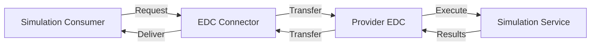

:::warning AI-Generated Example Content

This documentation is an AI-generated example for demonstration purposes. The Simulation KIT is a placeholder and does not represent an actual implementation or standardized use case within the Eclipse Tractus-X ecosystem.

:::

## Introduction

This page provides technical guidance for implementing the Simulation KIT in your applications and services.

## Architecture Overview

The Simulation KIT enables federated simulation through:

1. **Simulation Service Provider**: Exposes simulation capabilities via standardized APIs
2. **Simulation Consumer**: Initiates and consumes simulation results
3. **Data Connectors**: Handle sovereign data exchange (EDC-based)
4. **Simulation Registry**: Discovers available simulation services
5. **Result Storage**: Manages simulation outputs and metadata



## API Specifications

### Simulation Request API

**POST** `/api/v1/simulation/request`

Request a new simulation execution.

```json
{
  "simulationId": "sim-123",
  "modelType": "crash-test",
  "parameters": {
    "speed": 50,
    "angle": 45,
    "mass": 1500
  },
  "outputFormat": "step",
  "priority": "normal"
}
```

**Response**:
```json
{
  "requestId": "req-456",
  "status": "queued",
  "estimatedCompletion": "2026-02-04T14:30:00Z",
  "_links": {
    "status": "/api/v1/simulation/status/req-456",
    "cancel": "/api/v1/simulation/cancel/req-456"
  }
}
```

### Simulation Status API

**GET** `/api/v1/simulation/status/{requestId}`

Check the status of a simulation request.

**Response**:
```json
{
  "requestId": "req-456",
  "status": "completed",
  "progress": 100,
  "startedAt": "2026-02-04T14:00:00Z",
  "completedAt": "2026-02-04T14:25:00Z",
  "resultsAvailable": true,
  "_links": {
    "results": "/api/v1/simulation/results/req-456"
  }
}
```

### Simulation Results API

**GET** `/api/v1/simulation/results/{requestId}`

Retrieve simulation results.

**Response**: Binary data in requested format (STEP, STL, JSON, etc.)

## Semantic Models

### SimulationRequest

Defines the structure for requesting a simulation.

```json
{
  "$schema": "http://json-schema.org/draft-07/schema#",
  "type": "object",
  "properties": {
    "simulationId": {"type": "string"},
    "modelType": {"type": "string"},
    "parameters": {"type": "object"},
    "outputFormat": {"type": "string"},
    "priority": {"type": "string", "enum": ["low", "normal", "high"]}
  },
  "required": ["simulationId", "modelType", "parameters"]
}
```

### SimulationResult

Defines metadata for simulation results.

```json
{
  "$schema": "http://json-schema.org/draft-07/schema#",
  "type": "object",
  "properties": {
    "requestId": {"type": "string"},
    "simulationType": {"type": "string"},
    "executionTime": {"type": "number"},
    "accuracy": {"type": "string"},
    "convergence": {"type": "boolean"},
    "outputFiles": {"type": "array", "items": {"type": "object"}},
    "metadata": {"type": "object"}
  }
}
```

## Implementation Guide

### Step 1: Set Up Provider Service

```python
from simulation_kit import SimulationProvider

provider = SimulationProvider(
    service_name="crash-simulation-service",
    connector_url="https://edc.provider.com",
    capabilities=["crash-test", "aerodynamics"]
)

@provider.register_simulation("crash-test")
def run_crash_simulation(parameters):
    # Your simulation logic here
    result = execute_simulation(parameters)
    return result

provider.start()
```

### Step 2: Implement Consumer

```python
from simulation_kit import SimulationConsumer

consumer = SimulationConsumer(
    connector_url="https://edc.consumer.com"
)

# Request simulation
request_id = consumer.request_simulation(
    provider="https://provider.com/simulation",
    model_type="crash-test",
    parameters={"speed": 50, "angle": 45}
)

# Wait for completion
result = consumer.wait_for_result(request_id)
print(f"Simulation completed: {result}")
```

### Step 3: Configure EDC

Ensure your EDC connector has the necessary policies configured:

```json
{
  "@context": "https://w3id.org/edc/v0.0.1/ns/",
  "@type": "PolicyDefinition",
  "@id": "simulation-policy",
  "policy": {
    "permission": [{
      "action": "USE",
      "constraint": {
        "leftOperand": "PURPOSE",
        "operator": "eq",
        "rightOperand": "simulation.collaborative"
      }
    }]
  }
}
```

## Data Sovereignty

All simulation exchanges respect data sovereignty principles:

- **Usage Policies**: Define how simulation results can be used
- **Access Control**: Control who can request simulations
- **Data Residency**: Results stay under provider control
- **Audit Trail**: All requests and transfers are logged

## Best Practices

1. **Parameterization**: Use standardized parameter names
2. **Result Formats**: Support multiple output formats
3. **Error Handling**: Provide meaningful error messages
4. **Versioning**: Version your simulation models and APIs
5. **Testing**: Validate results against known benchmarks

## Troubleshooting

### Common Issues

**Issue**: Simulation request times out  
**Solution**: Check network connectivity, increase timeout, verify provider availability

**Issue**: Results format mismatch  
**Solution**: Ensure requested format is supported by provider

**Issue**: Authentication failure  
**Solution**: Verify connector credentials and access policies

## Sample Code Repository

Complete reference implementations available at:  
`https://github.com/eclipse-tractusx/simulation-kit`

---

**For questions and support**, join the Tractus-X community channels.
